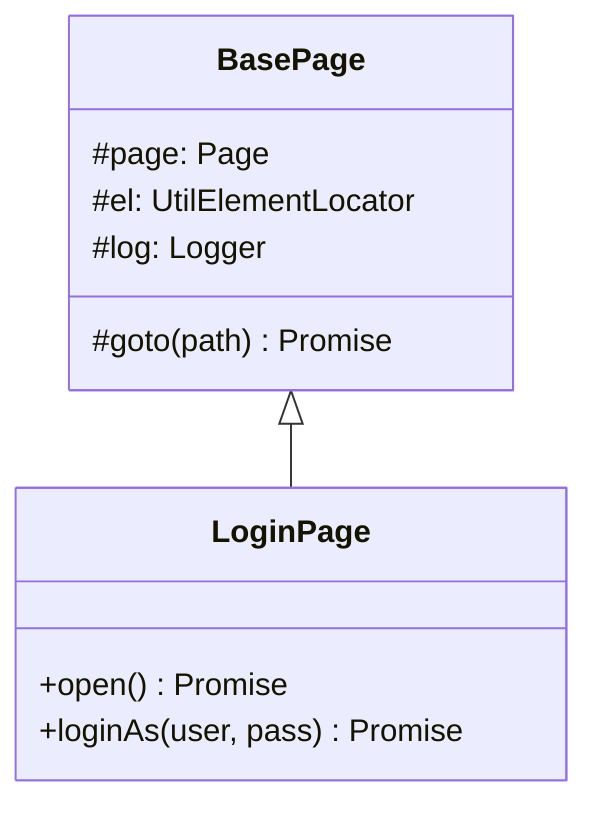
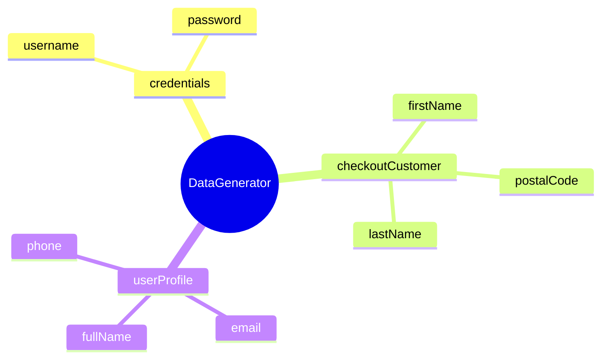
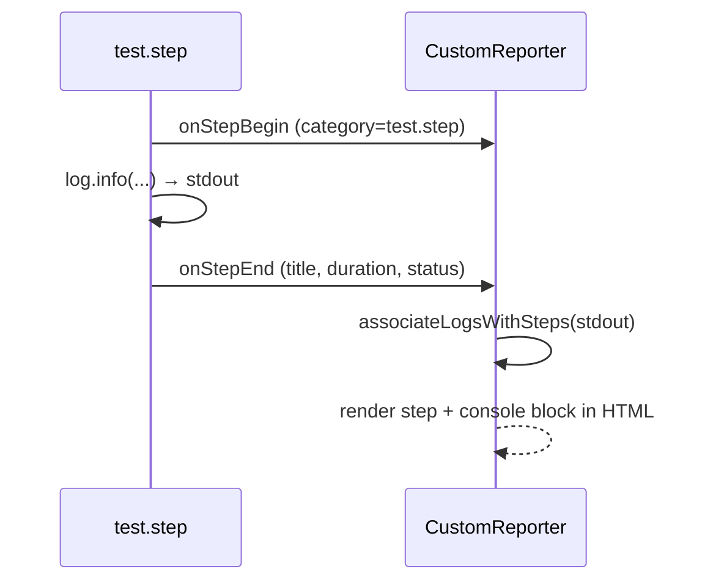

# Advance Playwright Framework (1.x)

> Production-grade Playwright + TypeScript automation framework built by [Pramod Dutta](https://thetestingacademy.com) for **The Testing Academy**.

[](https://playwright.dev)
[](https://www.typescriptlang.org)
[](https://nodejs.org)
[]()

A complete, opinionated, batteries-included Playwright framework with **Page Object Model**, **fixtures**, **data-driven testing**, **multi-env config**, **Winston logging**, a **custom HTML reporter**, **Allure**, and **CI-ready scripts**.

---

## Table of Contents

- [Features](#features)
- [Folder Structure](#folder-structure)
- [Quick Start](#quick-start)
- [NPM Scripts](#npm-scripts)
- [Path Aliases](#path-aliases)
- [Environment Configuration](#environment-configuration)
- [Test Tags & Filtering](#test-tags--filtering)
- [Logging (Winston)](#logging-winston)
- [Element Utilities (UtilElementLocator)](#element-utilities-utilelementlocator)
- [Page Objects (BasePage)](#page-objects-basepage)
- [Test Data Factory (Faker)](#test-data-factory-faker)
- [Writing Tests — Steps + Logging](#writing-tests--steps--logging)
- [ESM & Import Extensions](#esm--import-extensions)
- [Reporting](#reporting)
- [AI Agent Rules](#ai-agent-rules)
- [Project Rules](#project-rules)
- [Phase 1 Walkthrough](#phase-1-walkthrough)
- [Contributing](#contributing)
- [Author](#author)

---

## Features

- **Playwright Test runner** — parallel, retries, projects, trace viewer
- **TypeScript strict mode** with path aliases (`@pages`, `@utils`, `@api`, …)
- **Page Object Model** under `src/pages/`
- **Custom Fixtures** under `src/fixtures/`
- **API client layer** under `src/api/` (REST + GraphQL ready)
- **Multi-env config** via `dotenv` — qa, stg, prod, dev
- **Data-driven testing** — CSV (`csv-parse`), JSON, XLSX (`xlsx`)
- **Test data factories** with `@faker-js/faker`
- **Winston logger** with file + console + rotation
- **Custom HTML Reporter** (`CustomReporter.ts`) — TTA-branded, real-time
- **Allure** reporter integration
- **Tag-based execution** — `@p0`, `@p1`, `@e2e`, `@smoke`, `@lor`
- **Cross-browser** — Chromium, Firefox, WebKit, Mobile Chrome (Pixel 5)
- **CI-aware config** — auto-tunes retries, workers, `forbidOnly`
- **AI-agent rule files** for Claude Code, Copilot, Cursor, Windsurf, Augment, Antigravity, Aider, Codex, Jules
- **ESLint + Prettier + tsc** quality gates enforced on every test change
- **Docker-ready** (Dockerfile placeholder)

---

## Folder Structure

```
AdvancePlaywrightFramework1x/
├── src/
│   ├── api/                   # API clients (REST / GraphQL)
│   ├── config/                # Env loaders, constants, URLs
│   ├── fixtures/              # Playwright custom fixtures
│   ├── pages/                 # Page Object Model classes
│   ├── testdata/              # CSV / JSON / XLSX test data
│   ├── tests/                 # Spec files (*.spec.ts)
│   └── utils/                 # Helpers
│       ├── logger.ts          # Winston logger (+ createLogger scope)
│       ├── UtilElementLocator.ts  # Locator action wrapper (Flex type)
│       ├── DataGenerator.ts   # Faker test-data factory
│       └── CustomReporter.ts  # TTA HTML reporter
│
├── docs/
│   └── phase1/
│       └── prompts.md         # Phase 1 conversation log
│
├── rules/                     # Canonical project rules
│   ├── README.md
│   └── test-quality-checks.md
│
├── logs/                      # Winston log output (gitignored)
├── allure-results/            # Allure raw results (gitignored)
├── allure-report/             # Allure HTML (gitignored)
├── playwright-report/         # Playwright HTML (gitignored)
├── test-results/              # Playwright test artifacts (gitignored)
├── tta-report/                # Custom TTA HTML reports (gitignored)
│
├── .github/
│   ├── copilot-instructions.md
│   └── workflows/             # GitHub Actions CI
│
├── .claude/                   # Claude Code config (optional)
├── .cursor/rules/             # Cursor MDC rules
├── .windsurf/rules/           # Windsurf rules
├── .augment/rules/            # Augment Code rules
│
├── .cursorrules               # Cursor legacy
├── .windsurfrules             # Windsurf legacy
├── .augment-guidelines        # Augment legacy
├── AGENTS.md                  # Antigravity / Codex / Aider / Jules
├── CLAUDE.md                  # Claude Code project rules
│
├── .env                       # Local env (gitignored)
├── .gitignore
├── Dockerfile
├── playwright.config.ts       # Playwright configuration
├── tsconfig.json              # TypeScript config + path aliases
├── package.json
├── package-lock.json
└── README.md
```

---


## Quick Start

### Prerequisites

- Node.js **18+**
- npm 9+
- (Optional) Allure CLI: `brew install allure` / `scoop install allure`

### Install

```bash
git clone https://github.com/PramodDutta/AdvancePlaywrightFramework1x.git
cd AdvancePlaywrightFramework1x
npm install
npx playwright install --with-deps
```

### Run tests

```bash
npm test                  # all tests, all projects
npm run test:chromium     # chromium only
npm run test:ui           # UI mode (debug-friendly)
npm run test:p0           # smoke / critical only
```

### View report

```bash
npm run test:report       # Playwright HTML
npm run test:allure       # Allure HTML
# TTA custom report auto-generated at tta-report/index.html
```

---

## NPM Scripts

| Script | Purpose |
|--------|---------|
| `test` | Run all tests, all projects |
| `test:headed` | Run with browser visible |
| `test:ui` | Playwright UI mode |
| `test:chromium` / `test:firefox` / `test:webkit` | Per-browser run |
| `test:debug` | Playwright Inspector |
| `test:e2e` | Tag `@e2e` |
| `test:p0` / `test:p1` | Priority-tagged runs |
| `test:lor` | Tag `@lor` (Lord of the Rings test suite 😉) |
| `test:report` | Open Playwright HTML report |
| `test:report:ci` | Serve report on `0.0.0.0:9323` for CI |
| `test:allure` | Generate + open Allure HTML |
| `lint` / `lint:fix` | ESLint check / fix |
| `typecheck` | `tsc --noEmit` |
| `format` / `format:check` | Prettier |
| `build` | `tsc` compile |
| `clean` | Wipe reports, results, cache |

---

## Path Aliases

Defined in `tsconfig.json`:

| Alias | Resolves to |
|-------|------------|
| `@api/*` | `src/api/*` |
| `@config/*` | `src/config/*` |
| `@fixtures/*` | `src/fixtures/*` |
| `@pages/*` | `src/pages/*` |
| `@testdata/*` | `src/testdata/*` |
| `@tests/*` | `src/tests/*` |
| `@utils/*` | `src/utils/*` |

Example:
```ts
import logger from '@utils/logger.js';
import { LoginPage } from '@pages/LoginPage.js';
import { users } from '@testdata/users.json';
```

---

## Environment Configuration

`.env` (root) — loaded by `dotenv` in `playwright.config.ts`.

Supported keys:

```dotenv
TTA_ENV=qa                # qa | stg | prod | dev
BASE_URL=                 # override everything if set
QA_BASE_URL=https://app.thetestingacademy.com
STG_BASE_URL=https://stage.thetestingacademy.com
PROD_BASE_URL=https://app.thetestingacademy.com
DEV_BASE_URL=http://localhost:3000
LOG_LEVEL=info            # winston log level
TEST_ENV=UAT              # shown in TTA report
TEST_AUTHOR=Pramod
```

Switch env:
```bash
TTA_ENV=stg npm test
```

---

## Test Tags & Filtering

Tag your tests:

```ts
test('login with valid creds @p0 @smoke @e2e', async ({ page }) => { ... });
```

Filter:

```bash
npm run test:p0           # @p0 only
npm run test:e2e          # @e2e only
npx playwright test --grep "@smoke"
npx playwright test --grep-invert "@flaky"
```

---

## Logging (Winston)

```ts
import logger from '@utils/logger.js';

logger.info('login start', { user: 'pramod' });
logger.warn('slow API response', { ms: 3200 });
logger.error('test failed', new Error('boom'));
logger.debug('payload %o', { id: 1 });
```

Output:
- Console — colorized, timestamped
- `logs/error.log` — errors only (JSON, 5MB rotation × 5)
- `logs/combined.log` — everything (JSON, 5MB rotation × 5)

Scoped child loggers tag every line with their origin:

```ts
import { createLogger } from '@utils/logger.js';

const log = createLogger('LoginPage');
log.info('loginAs standard_user');
// 2026-06-02 08:10:23 [info] [LoginPage] loginAs standard_user
```

---

## Element Utilities (UtilElementLocator)

**Concept:** `UtilElementLocator` is a thin wrapper around Playwright's `Locator` that exposes intent-revealing action helpers (`click`, `fill`, `getText`, `waitForVisible`, …) and accepts either a CSS string **or** a built `Locator` via the `Flex` type.

**Why:** Page Objects shouldn't repeat `await page.locator(sel).click({ timeout })` everywhere. One wrapper centralises timeouts, logging, and the string-or-Locator ambiguity.

**Q&A — why use this?**
- **Q: Why the `Flex = string | Locator` type?** A: Call sites pass `'[data-test="username"]'` *or* `page.getByTestId('username')` — the wrapper normalises both via `toLocator()`.
- **Q: Where do the debug logs come from?** A: Each instance owns a scoped Winston logger (`createLogger(scope)`); actions like `click`/`fill` emit a `debug` line.
- **Q: Why keep a `type()` method when Playwright deprecated `.type()`?** A: It maps to `pressSequentially()` under the hood but keeps a name students recognise.

```mermaid
flowchart TD
    A["target: Flex (string | Locator)"] --> B{typeof string?}
    B -->|Yes| C["page.locator&#40;target&#41;"]
    B -->|No| D[use Locator as-is]
    C --> E[action: click / fill / getText ...]
    D --> E
    E --> F[log.debug + Playwright call]
```



```ts
import { UtilElementLocator } from '@utils/UtilElementLocator.js';

const el = new UtilElementLocator(page, 'LoginPage');
await el.fill('[data-test="username"]', 'standard_user');
await el.click(page.getByTestId('login-button'));
await el.waitForVisible('[data-test="inventory-container"]');
```

---

## Page Objects (BasePage)

**Concept:** `BasePage` is the abstract parent for every Page Object. It wires up the three things each page needs — the `page` handle, an `el` (`UtilElementLocator`), and a scoped `log` — plus a `goto()` navigation helper.

**Why:** Removes boilerplate from every page and guarantees consistent logging scope (the subclass name) and a single navigation pattern.

**Q&A — why use this?**
- **Q: What does the constructor's `scope` argument do?** A: It names the logger and the element-util instance, so logs read `[LoginPage] …`.
- **Q: Does BasePage pre-build any locators?** A: No — subclasses declare their own `private readonly` Locator fields. Base stays intentionally thin.
- **Q: Why is `goto()` protected?** A: Navigation is an internal detail; pages expose intent methods like `open()` instead.



```ts
import { BasePage } from './BasePage.js';

export class LoginPage extends BasePage {
    static readonly PATH = '/playwright/ttacart/index.html';
    private readonly usernameInput = this.page.locator('[data-test="username"]');

    constructor(page: Page) {
        super(page, 'LoginPage');
    }

    async open(): Promise<void> {
        await this.goto(LoginPage.PATH);
    }
}
```

---

## Test Data Factory (Faker)

**Concept:** `DataGenerator` is a static factory over `@faker-js/faker` producing the data TTACart needs — login credentials, checkout customer info, and full user profiles.

**Why:** Hard-coded fixtures rot and collide. Random-but-typed data keeps tests independent and surfaces validation bugs.

**Q&A — why use this?**
- **Q: Why static methods?** A: No state to hold — call `DataGenerator.credentials()` without `new`.
- **Q: What's `checkoutCustomer()` for?** A: The TTACart checkout step-one form needs `firstName`, `lastName`, `postalCode` — one call returns all three.
- **Q: Faker v10 gotcha?** A: It's ESM-only and renamed APIs — use `faker.internet.username()` (not `userName`) and `faker.location.zipCode()` (not `address.zipCode`).



```ts
import { DataGenerator } from '@utils/DataGenerator.js';

const { username, password } = DataGenerator.credentials();
const customer = DataGenerator.checkoutCustomer();
// { firstName: 'Jaylen', lastName: 'Hahn', postalCode: '90210' }
```

---

## Writing Tests — Steps + Logging

**Concept:** Wrap each logical action in `test.step('label', async () => {…})` and emit a scoped logger line inside it. The custom TTA reporter surfaces both — step titles **and** their console output.

**Why:** Plain Page-Object calls don't appear as steps in the report. `CustomReporter` only records `step.category === 'test.step'`, and pipes test stdout into each step's console block.

**Q&A — why use this?**
- **Q: Why does the report show empty steps without this?** A: Without `test.step()`, there are no `test.step` categories for the reporter to capture.
- **Q: Where do per-step logs come from?** A: `associateLogsWithSteps` matches test stdout (your `log.info(...)`) to steps by title and order.
- **Q: Do I still get the assertion?** A: Yes — `expect()` lives inside its own step, so a failure pins to that step.



```ts
import { test, expect } from '@playwright/test';
import { LoginPage } from '@pages/LoginPage.js';
import { createLogger } from '@utils/logger.js';

const log = createLogger('login.spec');

test('logs in with valid credentials @p0', async ({ page }) => {
    const loginPage = new LoginPage(page);
    await test.step('Open the TTACart login page', async () => {
        log.info('Opening the TTACart login page');
        await loginPage.open();
    });
    await test.step('Login as standard_user', async () => {
        log.info('Logging in as standard_user');
        await loginPage.loginAs('standard_user', 'tta_secret');
    });
    await test.step('Verify login form is hidden', async () => {
        await expect(page.locator('[data-test="login-button"]')).toBeHidden();
    });
});
```

---

## ESM & Import Extensions

**Concept:** The project is native ESM (`"type": "module"` + `module: Node16`). Relative and path-alias imports MUST carry an explicit `.js` extension — even though the source is `.ts`.

**Why:** `@faker-js/faker` v10 is ESM-only, forcing the whole project to ESM. Node ESM resolution does not guess extensions or `index.js`.

**Q&A — why use this?**
- **Q: Why `.js` when the file is `.ts`?** A: TypeScript compiles `BasePage.ts` → `BasePage.js`; at runtime only `.js` exists, so imports target the emitted name.
- **Q: Do package imports need `.js`?** A: No — only relative/alias file imports (`./BasePage.js`, `@utils/logger.js`). `@playwright/test` and `@faker-js/faker` stay bare.
- **Q: Barrel file `index.ts` too?** A: Yes — every re-export inside a barrel needs `.js` as well.

```ts
import { BasePage } from './BasePage.js';          // ✅ relative + .js
import { LoginPage } from '@pages/LoginPage.js';     // ✅ alias + .js
import { test } from '@playwright/test';             // ✅ package, no extension
```

---

## Reporting

| Reporter | Output | Trigger |
|----------|--------|---------|
| Custom TTA | `tta-report/index.html` | auto every run |
| Playwright HTML | `playwright-report/` | auto; `npm run test:report` |
| JSON | `test-results/results.json` | auto |
| Allure | `allure-results/` → `allure-report/` | `npm run test:allure` |
| List (console) | stdout | auto |

---

## AI Agent Rules

This repo ships rules for every major AI coding assistant:

| Tool | File |
|------|------|
| Claude Code | [`CLAUDE.md`](./CLAUDE.md) |
| GitHub Copilot | [`.github/copilot-instructions.md`](./.github/copilot-instructions.md) |
| Cursor | [`.cursorrules`](./.cursorrules), [`.cursor/rules/`](./.cursor/rules/) |
| Windsurf | [`.windsurfrules`](./.windsurfrules), [`.windsurf/rules/`](./.windsurf/rules/) |
| Augment Code | [`.augment-guidelines`](./.augment-guidelines), [`.augment/rules/`](./.augment/rules/) |
| Antigravity / Codex / Aider / Jules | [`AGENTS.md`](./AGENTS.md) |

All enforce the same rule: **`npm run typecheck && npm run lint`** after every test change.

---

## Project Rules

Canonical source: [`rules/`](./rules/).

| Rule | When it applies |
|------|-----------------|
| [test-quality-checks.md](./rules/test-quality-checks.md) | Any change under `src/tests/**` |

---

## Phase 1 Walkthrough

Full prompt-by-prompt build log for Phase 1 lives at [`docs/phase1/prompts.md`](./docs/phase1/prompts.md). Replay every step to recreate the framework from scratch.

---

## Contributing

1. Fork
2. Branch (`git checkout -b feat/my-thing`)
3. Add tests + `npm run typecheck && npm run lint`
4. Commit + push
5. Open PR

---

## Author

**Meeti Jha** 