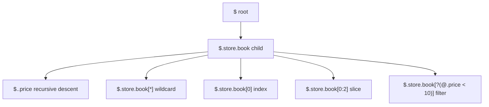
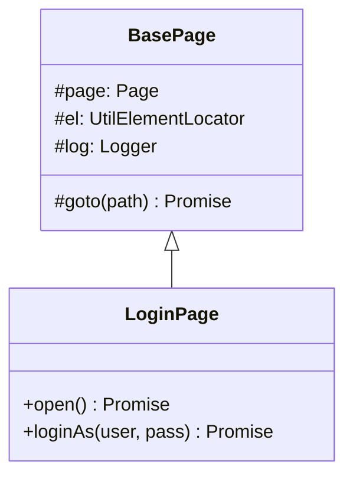
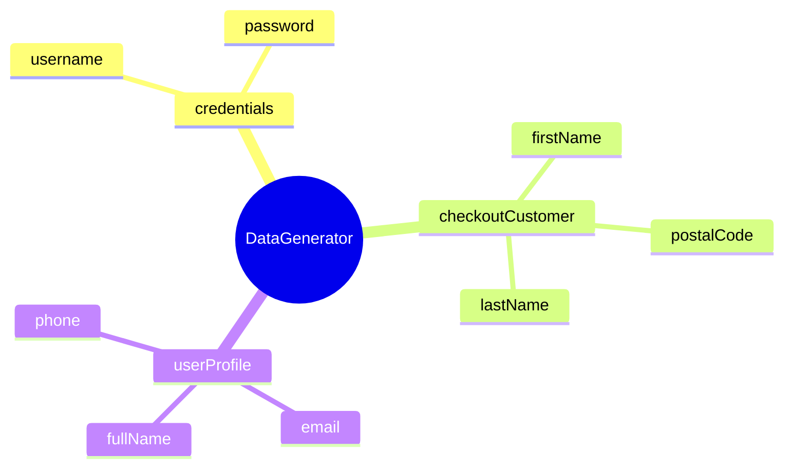
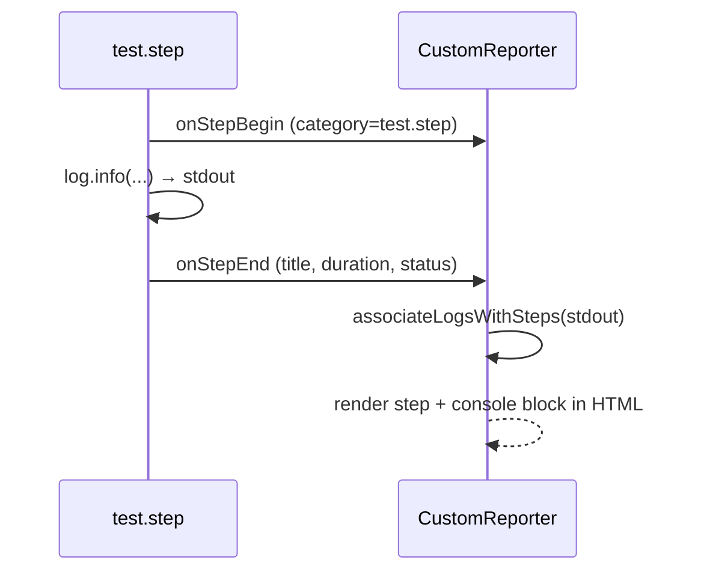
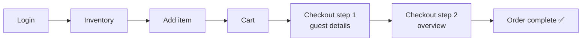

# Advance Playwright Framework (1.x)

[](https://playwright.dev)
[](https://www.typescriptlang.org)
[](https://nodejs.org)
[]()

A complete, opinionated, batteries-included Playwright framework with **Page Object Model**, **fixtures**, **data-driven testing**, **multi-env config**, **Winston logging**, a **custom HTML reporter**, **Allure**, and **CI-ready scripts**.

---

## Table of Contents

- [Features](#features)
- [Folder Structure](#folder-structure)
- [Quick Start](#quick-start)
- [NPM Scripts](#npm-scripts)
- [Path Aliases](#path-aliases)
- [Environment Configuration](#environment-configuration)
- [API Testing](#api-testing)
- [JSONPath Queries (jsonpath-plus)](#jsonpath-queries-jsonpath-plus)
- [JSON Schema Validation (Ajv)](#json-schema-validation-ajv)
- [Test Tags & Filtering](#test-tags--filtering)
- [Logging (Winston)](#logging-winston)
- [Element Utilities (UtilElementLocator)](#element-utilities-utilelementlocator)
- [Page Objects (BasePage)](#page-objects-basepage)
- [Test Data Factory (Faker)](#test-data-factory-faker)
- [Writing Tests — Steps + Logging](#writing-tests--steps--logging)
- [Fixtures (Page Object injection)](#fixtures-page-object-injection)
- [Per-Step Screenshots (visualStep)](#per-step-screenshots-visualstep)
- [End-to-End Checkout Flow](#end-to-end-checkout-flow)
- [Module System (CommonJS)](#module-system-commonjs)
- [Reporting](#reporting)
- [Custom TTA Report — Visual Flow](#custom-tta-report--visual-flow)
- [AI Agent Rules](#ai-agent-rules)
- [Project Rules](#project-rules)
- [Phase 1 Walkthrough](#phase-1-walkthrough)
- [Contributing](#contributing)
- [Author](#author)

---

## Features

- **Playwright Test runner** — parallel, retries, projects, trace viewer
- **TypeScript strict mode** with path aliases (`@pages`, `@utils`, `@api`, …)
- **Page Object Model** under `src/pages/`
- **Custom Fixtures** under `src/fixtures/`
- **API client layer** under `src/api/` (REST + GraphQL ready)
- **Dedicated API project** for `src/tests/apiTests/**`, so API specs run once without browser projects
- **Multi-env config** via `dotenv` — qa, stg, prod, dev
- **Data-driven testing** — CSV (`csv-parse`), JSON, XLSX (`xlsx`)
- **Test data factories** with `@faker-js/faker`
- **Winston logger** with file + console + rotation
- **Custom HTML Reporter** (`CustomReporter.ts`) — TTA-branded, real-time
- **Allure** reporter integration
- **Tag-based execution** — `@p0`, `@p1`, `@e2e`, `@smoke`, `@lor`
- **Cross-browser** — Chromium, Firefox, WebKit, Mobile Chrome (Pixel 5)
- **CI-aware config** — auto-tunes retries, workers, `forbidOnly`
- **AI-agent rule files** for Claude Code, Copilot, Cursor, Windsurf, Augment, Antigravity, Aider, Codex, Jules
- **ESLint + Prettier + tsc** quality gates enforced on every test change
- **Docker-ready** (Dockerfile placeholder)

---

## Folder Structure

```
AdvancePlaywrightFramework1x/
├── src/
│   ├── api/                   # API clients (REST / GraphQL)
│   ├── config/                # Env loaders + credentials accessor
│   │   └── credentials.ts     # Login creds sourced from .env
│   ├── fixtures/              # Playwright custom fixtures
│   │   └── test-base.ts       # `test` extended with a fixture per Page Object
│   ├── pages/                 # Page Object Model classes
│   │   ├── BasePage.ts        # Abstract parent (page, el, log, goto)
│   │   ├── LoginPage.ts
│   │   ├── InventoryPage.ts
│   │   ├── ItemDetailPage.ts
│   │   ├── CartPage.ts
│   │   ├── CheckoutStepOnePage.ts
│   │   ├── CheckoutStepTwoPage.ts
│   │   ├── CheckoutCompletePage.ts
│   │   └── index.ts           # Barrel re-exports
│   ├── testdata/              # CSV / JSON / XLSX test data
│   │   ├── booking.data.ts    # Booking payload factory
│   │   └── schemas/           # JSON Schema (Draft-07) for Ajv validation
│   ├── tests/                 # Spec files (*.spec.ts)
│   │   ├── apiTests/          # API specs, run with the `api` Playwright project
│   │   │   ├── 01_restfulbooker_raw/        # raw request fixture
│   │   │   ├── 02_restfulbooker_apiHelper/  # ApiHelper wrapper
│   │   │   ├── 03_restfulbooker_fixture_e2e/# BookingApi client + fixtures
│   │   │   ├── 04_jsonpath_plus/            # JSONPath queries + cheat sheet
│   │   │   └── 05_ajv_schema/               # Ajv schema validation
│   │   └── e2e/               # Full login→checkout→complete flow
│   └── utils/                 # Helpers
│       ├── logger.ts          # Winston logger (+ createLogger scope)
│       ├── UtilElementLocator.ts  # Locator action wrapper (Flex type)
│       ├── DataGenerator.ts   # Faker test-data factory
│       ├── ApiHelper.ts       # HTTP wrapper (GET/POST/PUT/PATCH/DELETE + retry)
│       ├── schemaValidator.ts # Ajv + ajv-formats schema validation
│       ├── visualStep.ts      # test.step + per-step screenshot
│       └── CustomReporter.ts  # TTA HTML reporter
│
├── docs/
│   ├── images/                # README screenshots
│   ├── ttacart-pom-creator/   # Skill: live-page → Page Object generator
│   └── phase1/
│       └── prompts.md         # Phase 1 conversation log
│
├── rules/                     # Canonical project rules
│   ├── README.md
│   └── test-quality-checks.md
│
├── logs/                      # Winston log output (gitignored)
├── allure-results/            # Allure raw results (gitignored)
├── allure-report/             # Allure HTML (gitignored)
├── playwright-report/         # Playwright HTML (gitignored)
├── test-results/              # Playwright test artifacts (gitignored)
├── tta-report/                # Custom TTA HTML reports (gitignored)
│
├── .github/
│   ├── copilot-instructions.md
│   └── workflows/             # GitHub Actions CI
│
├── .claude/                   # Claude Code config (optional)
├── .cursor/rules/             # Cursor MDC rules
├── .windsurf/rules/           # Windsurf rules
├── .augment/rules/            # Augment Code rules
│
├── .cursorrules               # Cursor legacy
├── .windsurfrules             # Windsurf legacy
├── .augment-guidelines        # Augment legacy
├── AGENTS.md                  # Antigravity / Codex / Aider / Jules
├── CLAUDE.md                  # Claude Code project rules
│
├── .env                       # Local env (gitignored)
├── .gitignore
├── Dockerfile
├── playwright.config.ts       # Playwright configuration
├── tsconfig.json              # TypeScript config + path aliases
├── package.json
├── package-lock.json
└── README.md
```

---


## Quick Start

### Prerequisites

- Node.js **18+**
- npm 9+
- (Optional) Allure CLI: `brew install allure` / `scoop install allure`

### Install

```bash
git clone https://github.com/PramodDutta/AdvancePlaywrightFramework1x.git
cd AdvancePlaywrightFramework1x
npm install
npx playwright install --with-deps
```

### Run tests

```bash
npm test                  # all tests, all projects
npx playwright test src/tests/apiTests/01_restfulbooker_raw/crud.spec.ts --project=api
npm run test:chromium     # chromium only
npm run test:ui           # UI mode (debug-friendly)
npm run test:p0           # smoke / critical only
```

### View report

```bash
npm run test:report       # Playwright HTML
npm run test:allure       # Allure HTML
# TTA custom report auto-generated at tta-report/index.html
```

---

## NPM Scripts

| Script | Purpose |
|--------|---------|
| `test` | Run all tests, all projects |
| `test:headed` | Run with browser visible |
| `test:ui` | Playwright UI mode |
| `test:chromium` / `test:firefox` / `test:webkit` | Per-browser run |
| `test:debug` | Playwright Inspector |
| `test:e2e` | Tag `@e2e` |
| `test:p0` / `test:p1` | Priority-tagged runs |
| `test:lor` | Tag `@lor` (Lord of the Rings test suite 😉) |
| `test:report` | Open Playwright HTML report |
| `test:report:ci` | Serve report on `0.0.0.0:9323` for CI |
| `test:allure` | Generate + open Allure HTML |
| `lint` / `lint:fix` | ESLint check / fix |
| `typecheck` | `tsc --noEmit` |
| `format` / `format:check` | Prettier |
| `build` | `tsc` compile |
| `clean` | Wipe reports, results, cache |

---

## Path Aliases

Defined in `tsconfig.json`:

| Alias | Resolves to |
|-------|------------|
| `@api/*` | `src/api/*` |
| `@config/*` | `src/config/*` |
| `@fixtures/*` | `src/fixtures/*` |
| `@pages/*` | `src/pages/*` |
| `@testdata/*` | `src/testdata/*` |
| `@tests/*` | `src/tests/*` |
| `@utils/*` | `src/utils/*` |

Example:
```ts
import logger from '@utils/logger';
import { LoginPage } from '@pages/LoginPage';
import { users } from '@testdata/users.json';
```

---

## Environment Configuration

`.env` (root) — loaded by `dotenv` in `playwright.config.ts`.

Supported keys:

```dotenv
TTA_ENV=qa                # qa | stg | prod | dev
BASE_URL=                 # override everything if set
QA_BASE_URL=https://app.thetestingacademy.com
STG_BASE_URL=https://stage.thetestingacademy.com
PROD_BASE_URL=https://app.thetestingacademy.com
DEV_BASE_URL=http://localhost:3000
API_BASE_URL=https://restful-booker.herokuapp.com
LOG_LEVEL=info            # winston log level
TEST_ENV=UAT              # shown in TTA report
TEST_AUTHOR=Pramod
```

---

## API Testing

API coverage targets Restful Booker by default and runs through Playwright's
`APIRequestContext`, not a browser page. Set `TTA_ENV=api` to resolve
`baseURL` from `API_BASE_URL`:

```bash
TTA_ENV=api npm test -- --project=api
npx playwright test src/tests/apiTests/02_restfulbooker_apiHelper/create-booking.spec.ts --project=api
```


### Dedicated API Project

API specs live under `src/tests/apiTests/` and run through the dedicated
Playwright `api` project:

```ts
{
  name: 'api',
  testMatch: /src\/tests\/apiTests\/.*\.spec\.ts/,
}
```

Browser projects ignore API specs, so request-only tests are not duplicated
across Chromium, Firefox, WebKit, or mobile browser projects.

### API Learning Layers

The API examples are split into layers so the same Restful Booker workflow can
grow from direct Playwright calls into reusable framework code:

| Layer | Location | Purpose |
|-------|----------|---------|
| Raw Playwright requests | `src/tests/apiTests/01_restfulbooker_raw/` | Uses the built-in `request` fixture directly for `GET`, `POST`, `PUT`, auth token, and CRUD examples. |
| Shared API helper | `src/tests/apiTests/02_restfulbooker_apiHelper/` + `src/utils/ApiHelper.ts` | Wraps `GET`, `POST`, `PUT`, `PATCH`, `DELETE`, query params, retry polling, typed JSON parsing, and status helpers. |
| Typed API client layer | `src/api/` + `src/tests/apiTests/03_restfulbooker_fixture_e2e/` | Home for endpoint-specific clients such as `BookingApi`, plus payload/response models and reusable flow verification as the API framework grows. |
| JSONPath response queries | `src/tests/apiTests/04_jsonpath_plus/` | Query JSON responses with `jsonpath-plus` — root, child, recursive descent, wildcard, index, slice, and filtration. Ships a [cheat sheet](src/tests/apiTests/04_jsonpath_plus/jsonpath-cheatsheet.md). |
| JSON Schema validation | `src/tests/apiTests/05_ajv_schema/` + `src/utils/schemaValidator.ts` + `src/testdata/schemas/` | Contract-test responses against Draft-07 JSON Schema with `ajv` + `ajv-formats`. |

Helper-based tests should prefer aliases and framework utilities:

```ts
import { expect, test } from '@playwright/test';
import { ApiHelper } from '@utils/ApiHelper';

test('POST /booking creates a booking @p0', async ({ request }) => {
    const api = new ApiHelper(request);
    const response = await api.post('/booking', {
        firstname: 'Pramod',
        lastname: 'Dutta',
        totalprice: 111,
        depositpaid: true,
        bookingdates: { checkin: '2026-04-01', checkout: '2026-04-10' },
        additionalneeds: 'Breakfast',
    });

    expect(api.isSuccess(response)).toBe(true);
});
```

```bash
API_BASE_URL=https://restful-booker.herokuapp.com \
BASE_URL=https://restful-booker.herokuapp.com \
npx playwright test src/tests/apiTests/01_restfulbooker_raw/crud.spec.ts --project=api
```

For multi-step API flows, use `test.describe.serial` and a typed state object to
pass values like auth tokens and booking IDs between tests:

```ts
interface BookingFlowState {
    token?: string;
    bookingId?: number;
}

test.describe.serial('Restful Booker CRUD API', () => {
    const bookingFlowState: BookingFlowState = {};

    test('TC#1 @p0 - Create token', async ({ request }) => {
        // set bookingFlowState.token
    });

    test('TC#2 @p0 - Create booking', async ({ request }) => {
        // set bookingFlowState.bookingId
    });

    test('TC#3 @p0 - Update booking', async ({ request }) => {
        // use bookingFlowState.token and bookingFlowState.bookingId
    });
});
```

Switch env:
```bash
TTA_ENV=stg npm test
```

---

## JSONPath Queries (jsonpath-plus)

**Concept:** [`jsonpath-plus`](https://github.com/JSONPath-Plus/JSONPath) lets you pull values out of a JSON document with a single path expression instead of manual `obj.a.b[0].c` chaining. Every query returns an **array of matches**.

**Why:** API responses are nested and array-heavy. One expression like `$.store.book[?(@.price < 10)]` replaces a loop-and-filter block and reads like a question.

**Q&A — why use this?**
- **Q: What's the difference between `.` and `..`?** A: `.child` is a direct child; `..child` (recursive descent) finds the key at **any** depth.
- **Q: How do I filter?** A: `[?(@.field <op> value)]` where `@` is the current element, e.g. `[?(@.category === 'fiction')]`.
- **Q: Does it ever return a single value?** A: By default no — always an array (take `[0]`), unless you pass `{ wrap: false }`.



```ts
import { JSONPath } from 'jsonpath-plus';

const cheap = JSONPath({ path: '$.store.book[?(@.price < 10)]', json: data });
const authors = JSONPath({ path: '$.store.book[*].author', json: data });
const allPrices = JSONPath({ path: '$..price', json: data }); // any depth
const lastBook = JSONPath({ path: '$.store.book[-1:]', json: data })[0];
```

Full operator reference: [`jsonpath-cheatsheet.md`](src/tests/apiTests/04_jsonpath_plus/jsonpath-cheatsheet.md). Runnable demo: [`jsonpath-queries.e2e.spec.ts`](src/tests/apiTests/04_jsonpath_plus/jsonpath-queries.e2e.spec.ts).

---

## JSON Schema Validation (Ajv)

**Concept:** Validate an API response against a **Draft-07 JSON Schema** with [`ajv`](https://ajv.js.org) + `ajv-formats`. `validateSchema(schema, data)` returns `{ valid, errors, errorText }` so a single `expect` covers the entire response shape.

**Why:** Field-by-field `expect` assertions miss added/removed/retyped fields. A schema is one contract check that catches structural drift — and `additionalProperties: false` flags unexpected keys.

**Q&A — why use this?**
- **Q: Why `ajv-formats`?** A: It enforces `format` keywords like `"date"`, `"email"`, `"uri"` — without it those formats are ignored.
- **Q: Where do schemas live?** A: `src/testdata/schemas/*.schema.json`, loaded in specs via `fs.readFileSync`.
- **Q: Why is the project on `ajv@8`?** A: `ajv-formats@3` requires Ajv v8; the repo pins `ajv@^8` directly (eslint keeps its own v6 nested).

```mermaid
flowchart LR
    S[*.schema.json] --> V["validateSchema&#40;schema, body&#41;"]
    B[API response] --> V
    V -->|valid| P[expect valid toBe true]
    V -->|invalid| E[errorText → failing assertion]
```



```ts
import { validateSchema } from '@utils/schemaValidator';
import * as fs from 'fs';
import * as path from 'path';

const schema = JSON.parse(
    fs.readFileSync(path.join(__dirname, '../../../testdata/schemas/create-booking.schema.json'), 'utf-8'),
);

const body = await bookingApi.createBooking(buildBooking({ firstname: 'Schema' }));
const { valid, errorText } = validateSchema(schema, body);
expect(valid, errorText).toBe(true);
```

Runnable demo: [`create-booking-schema.spec.ts`](src/tests/apiTests/05_ajv_schema/create-booking-schema.spec.ts).

---

## Test Tags & Filtering

Tag your tests:

```ts
test('login with valid creds @p0 @smoke @e2e', async ({ page }) => { ... });
```

Filter:

```bash
npm run test:p0           # @p0 only
npm run test:e2e          # @e2e only
npx playwright test --grep "@smoke"
npx playwright test --grep-invert "@flaky"
```

---

## Logging (Winston)

```ts
import logger from '@utils/logger';

logger.info('login start', { user: 'pramod' });
logger.warn('slow API response', { ms: 3200 });
logger.error('test failed', new Error('boom'));
logger.debug('payload %o', { id: 1 });
```

Output:
- Console — colorized, timestamped
- `logs/error.log` — errors only (JSON, 5MB rotation × 5)
- `logs/combined.log` — everything (JSON, 5MB rotation × 5)

Scoped child loggers tag every line with their origin:

```ts
import { createLogger } from '@utils/logger';

const log = createLogger('LoginPage');
log.info('loginAs standard_user');
// 2026-06-02 08:10:23 [info] [LoginPage] loginAs standard_user
```

---

## Element Utilities (UtilElementLocator)

**Concept:** `UtilElementLocator` is a thin wrapper around Playwright's `Locator` that exposes intent-revealing action helpers (`click`, `fill`, `getText`, `waitForVisible`, …) and accepts either a CSS string **or** a built `Locator` via the `Flex` type.

**Why:** Page Objects shouldn't repeat `await page.locator(sel).click({ timeout })` everywhere. One wrapper centralises timeouts, logging, and the string-or-Locator ambiguity.

**Q&A — why use this?**
- **Q: Why the `Flex = string | Locator` type?** A: Call sites pass `'[data-test="username"]'` *or* `page.getByTestId('username')` — the wrapper normalises both via `toLocator()`.
- **Q: Where do the debug logs come from?** A: Each instance owns a scoped Winston logger (`createLogger(scope)`); actions like `click`/`fill` emit a `debug` line.
- **Q: Why keep a `type()` method when Playwright deprecated `.type()`?** A: It maps to `pressSequentially()` under the hood but keeps a name students recognise.

```mermaid
flowchart TD
    A["target: Flex (string | Locator)"] --> B{typeof string?}
    B -->|Yes| C["page.locator&#40;target&#41;"]
    B -->|No| D[use Locator as-is]
    C --> E[action: click / fill / getText ...]
    D --> E
    E --> F[log.debug + Playwright call]
```



```ts
import { UtilElementLocator } from '@utils/UtilElementLocator';

const el = new UtilElementLocator(page, 'LoginPage');
await el.fill('[data-test="username"]', 'standard_user');
await el.click(page.getByTestId('login-button'));
await el.waitForVisible('[data-test="inventory-container"]');
```

---

## Page Objects (BasePage)

**Concept:** `BasePage` is the abstract parent for every Page Object. It wires up the three things each page needs — the `page` handle, an `el` (`UtilElementLocator`), and a scoped `log` — plus a `goto()` navigation helper.

**Why:** Removes boilerplate from every page and guarantees consistent logging scope (the subclass name) and a single navigation pattern.

**Q&A — why use this?**
- **Q: What does the constructor's `scope` argument do?** A: It names the logger and the element-util instance, so logs read `[LoginPage] …`.
- **Q: Does BasePage pre-build any locators?** A: No — subclasses declare their own `private readonly` Locator fields. Base stays intentionally thin.
- **Q: Why is `goto()` protected?** A: Navigation is an internal detail; pages expose intent methods like `open()` instead.



```ts
import { BasePage } from './BasePage';

export class LoginPage extends BasePage {
    static readonly PATH = '/playwright/ttacart/index.html';
    private readonly usernameInput = this.page.locator('[data-test="username"]');

    constructor(page: Page) {
        super(page, 'LoginPage');
    }

    async open(): Promise<void> {
        await this.goto(LoginPage.PATH);
    }
}
```

---

## Test Data Factory (Faker)

**Concept:** `DataGenerator` is a static factory over `@faker-js/faker` producing the data TTACart needs — login credentials, checkout customer info, and full user profiles.

**Why:** Hard-coded fixtures rot and collide. Random-but-typed data keeps tests independent and surfaces validation bugs.

**Q&A — why use this?**
- **Q: Why static methods?** A: No state to hold — call `DataGenerator.credentials()` without `new`.
- **Q: What's `checkoutCustomer()` for?** A: The TTACart checkout step-one form needs `firstName`, `lastName`, `postalCode` — one call returns all three.
- **Q: Which Faker version?** A: Pinned to **v8** (`@faker-js/faker@^8.4.1`) because it ships a CommonJS build — v9/v10 are ESM-only. v8 API: `faker.internet.userName()` (lowercase `username()` is v9+) and `faker.location.zipCode()` (v8 renamed `address` → `location`).



```ts
import { DataGenerator } from '@utils/DataGenerator';

const { username, password } = DataGenerator.credentials();
const customer = DataGenerator.checkoutCustomer();
// { firstName: 'Jaylen', lastName: 'Hahn', postalCode: '90210' }
```

---

## Writing Tests — Steps + Logging

**Concept:** Wrap each logical action in `test.step('label', async () => {…})` and emit a scoped logger line inside it. The custom TTA reporter surfaces both — step titles **and** their console output.

**Why:** Plain Page-Object calls don't appear as steps in the report. `CustomReporter` records `step.category === 'test.step'`, keeps test-level logs in the expanded test panel, and pipes test stdout into each step's console block when steps are present.

**Q&A — why use this?**
- **Q: Why does the report show no step breakdown without this?** A: Without `test.step()`, logs still appear under **Test Logs**, but there are no `test.step` categories for the reporter to render as individual steps.
- **Q: Where do per-step logs come from?** A: `associateLogsWithSteps` matches test stdout (your `log.info(...)`) to steps by title and order.
- **Q: Do I still get the assertion?** A: Yes — `expect()` lives inside its own step, so a failure pins to that step.



```ts
import { test, expect } from '@playwright/test';
import { LoginPage } from '@pages/LoginPage';
import { createLogger } from '@utils/logger';

const log = createLogger('login.spec');

test('logs in with valid credentials @p0', async ({ page }) => {
    const loginPage = new LoginPage(page);
    await test.step('Open the TTACart login page', async () => {
        log.info('Opening the TTACart login page');
        await loginPage.open();
    });
    await test.step('Login as standard_user', async () => {
        log.info('Logging in as standard_user');
        await loginPage.loginAs('standard_user', 'tta_secret');
    });
    await test.step('Verify login form is hidden', async () => {
        await expect(page.locator('[data-test="login-button"]')).toBeHidden();
    });
});
```

---

## Fixtures (Page Object injection)

**Concept:** `src/fixtures/test-base.ts` extends Playwright's `test` so every Page Object is available as a fixture. Ask for `cartPage` in the test args and it's handed over already constructed against the test's `page`.

**Why:** Removes `new XPage(page)` boilerplate from every spec and gives each test a fresh, isolated instance.

**Q&A — why use this?**
- **Q: Why not just `new LoginPage(page)`?** A: You can — but the fixture centralises construction so a constructor change touches one file, not every spec.
- **Q: Are pages opened for me?** A: No — fixtures hand over *constructed* (not *opened*) objects. Flows reach pages in different orders, so each spec calls `.open()` itself.
- **Q: What about credentials?** A: They come from `@config/credentials`, which reads `.env` (see [Environment Configuration](#environment-configuration)).

```ts
import { test, expect } from '@fixtures/test-base';

test('add to cart', async ({ inventoryPage, cartPage }) => {
    await inventoryPage.open();
    await inventoryPage.addToCart('tta-bike-light');
    await cartPage.open();
    expect(await cartPage.rowCount()).toBe(1);
});
```

---

## Per-Step Screenshots (visualStep)

**Concept:** `visualStep(page, title, fn)` wraps `test.step`, runs the step, then grabs a screenshot and attaches it as `step-<index>-<slug>` — the exact name the `CustomReporter` maps back to that step. Result: one image per step in the HTML report.

**Why:** Playwright's built-in `screenshot: 'only-on-failure'` captures a single frame at the failure point. `visualStep` gives a visual trail of *every* step, pass or fail — great for demos and debugging.

**Q&A — why use this?**
- **Q: How does the reporter know which screenshot belongs to which step?** A: By the attachment name `step-N-...`; the steps run sequentially so `N` matches the reporter's own step index.
- **Q: Does it slow tests down?** A: A little — one screenshot per step. Use it on showcase/e2e specs, not every micro-test.
- **Q: When is the shot taken?** A: At the *end* of the step, so it shows the resulting state.

```ts
import { visualStep } from '@utils/visualStep';

await visualStep(page, 'Open the cart', async () => {
    await cartPage.open();
    expect(await cartPage.rowCount()).toBe(1);
});
```

---

## End-to-End Checkout Flow

**Concept:** `src/tests/e2e-checkout.spec.ts` is the flagship test — log in → inventory → add item → cart → checkout step one → step two → order complete, each as a logged, screenshotted step driven entirely through Page Objects.

**Why:** Proves the whole stack (fixtures + Page Objects + DataGenerator + logger + reporter) works together against the live TTACart app.

**Q&A — why use this?**
- **Q: Where do the customer details come from?** A: `DataGenerator.checkoutCustomer()` — random first/last name + postal code per run.
- **Q: How is "order complete" verified?** A: `CheckoutCompletePage.assertOrderComplete()` checks the URL and the "Thank you for your order!" header.
- **Q: Why `@P0 @Regression` in the describe title?** A: Tags drive filtered runs (`npm run test:p0`) and show up as labels in the Allure report.



```ts
test('should complete checkout successfully', async ({
    inventoryPage, cartPage, checkoutStepOnePage, checkoutStepTwoPage, checkoutCompletePage, page,
}) => {
    const customer = DataGenerator.checkoutCustomer();
    await visualStep(page, 'Go to the inventory page', async () => inventoryPage.open());
    await visualStep(page, 'Add one item to the cart', async () => inventoryPage.addToCart(FIRST_ITEM_ID));
    await visualStep(page, 'Open the cart', async () => {
        await cartPage.open();
        expect(await cartPage.rowCount()).toBe(1);
    });
    await visualStep(page, 'Fill guest details (checkout step one)', async () => {
        await cartPage.checkout();
        await checkoutStepOnePage.fillGuest(customer);
        await checkoutStepOnePage.continue();
    });
    await visualStep(page, 'Finish the order (checkout step two)', async () => checkoutStepTwoPage.finish());
    await visualStep(page, 'Order is complete', async () => checkoutCompletePage.assertOrderComplete());
});
```

---

## Module System (CommonJS)

**Concept:** The project is plain **CommonJS** — no `"type": "module"`, with tsconfig `module: Node16` / `moduleResolution: Node16`. Relative and path-alias imports are **extensionless**, the way most TS projects read.

**Why:** Faker is pinned to v8 (which has a CommonJS build), so nothing forces the project to ESM. CommonJS keeps imports clean — no `.js` suffix gymnastics.

**Q&A — why this setup?**
- **Q: Do I add `.js` to imports?** A: No. `import { BasePage } from './BasePage'` — extensionless. (Under CommonJS, Node16 resolution adds the extension for you.)
- **Q: Why keep `moduleResolution: Node16` instead of classic `node`?** A: Node16 reads package `exports` maps (needed for modern deps) and isn't deprecated in TypeScript 6+; classic `node` is.
- **Q: What made this CommonJS rather than ESM?** A: Faker version. v8 = dual CJS/ESM → CommonJS works. v9/v10 are ESM-only and would force `"type": "module"` + `.js` extensions everywhere.

```ts
import { BasePage } from './BasePage';            // ✅ relative, no extension
import { LoginPage } from '@pages/LoginPage';      // ✅ alias, no extension
import { test } from '@playwright/test';           // ✅ package
```

---

## Reporting

| Reporter | Output | Trigger |
|----------|--------|---------|
| Custom TTA | `tta-report/index.html` | auto every run |
| Playwright HTML | `playwright-report/` | auto; `npm run test:report` |
| JSON | `test-results/results.json` | auto |
| Allure | `allure-results/` → `allure-report/` | `npm run test:allure` |
| List (console) | stdout | auto |

The Custom TTA reporter captures test stdout/stderr from `logger.info(...)` and
renders it in each expanded test under **Test Logs**. When a spec uses
`test.step(...)`, the same logs are also distributed into the matching step
details, so API and UI flows show both the action title and the relevant log
line in the report.

**Artifacts captured** (configured in `playwright.config.ts`):

| Artifact | Setting | When |
|----------|---------|------|
| Screenshot (failure) | `screenshot: 'only-on-failure'` | on any failure |
| Per-step screenshots | `visualStep()` helper | every step (see [visualStep](#per-step-screenshots-visualstep)) |
| Video | `video: 'on'` | **always** recorded |
| Trace | `trace: 'on-first-retry'` | on retry |

Allure is enriched with `environmentInfo` (env, baseURL, Node, OS, CI) and failure `categories`.

---

## Custom TTA Report — Visual Flow

The custom `CustomReporter.ts` produces a branded, real-time HTML report at
`tta-report/report_<timestamp>.html`. For the end-to-end checkout test it shows
the **whole journey** — every step with its console log, its own screenshot, and
the run video.

**Overview** — stats dashboard, environment bar, and the filterable test table:


**End-to-end flow** — expand the test row: each of the 6 steps shows its log
line and a screenshot, followed by the screenshots gallery and the run video:


---

## AI Agent Rules

This repo ships rules for every major AI coding assistant:

| Tool | File |
|------|------|
| Claude Code | [`CLAUDE.md`](./CLAUDE.md) |
| GitHub Copilot | [`.github/copilot-instructions.md`](./.github/copilot-instructions.md) |
| Cursor | [`.cursorrules`](./.cursorrules), [`.cursor/rules/`](./.cursor/rules/) |
| Windsurf | [`.windsurfrules`](./.windsurfrules), [`.windsurf/rules/`](./.windsurf/rules/) |
| Augment Code | [`.augment-guidelines`](./.augment-guidelines), [`.augment/rules/`](./.augment/rules/) |
| Antigravity / Codex / Aider / Jules | [`AGENTS.md`](./AGENTS.md) |

All enforce the same rule: **`npm run typecheck && npm run lint`** after every test change.

---

## Project Rules

Canonical source: [`rules/`](./rules/).

| Rule | When it applies |
|------|-----------------|
| [test-quality-checks.md](./rules/test-quality-checks.md) | Any change under `src/tests/**` |

---

## Phase 1 Walkthrough

Full prompt-by-prompt build log for Phase 1 lives at [`docs/phase1/prompts.md`](./docs/phase1/prompts.md). Replay every step to recreate the framework from scratch.

---

## Contributing

1. Fork
2. Branch (`git checkout -b feat/my-thing`)
3. Add tests + `npm run typecheck && npm run lint`
4. Commit + push
5. Open PR

---

## Author

**Meeti Jha** 